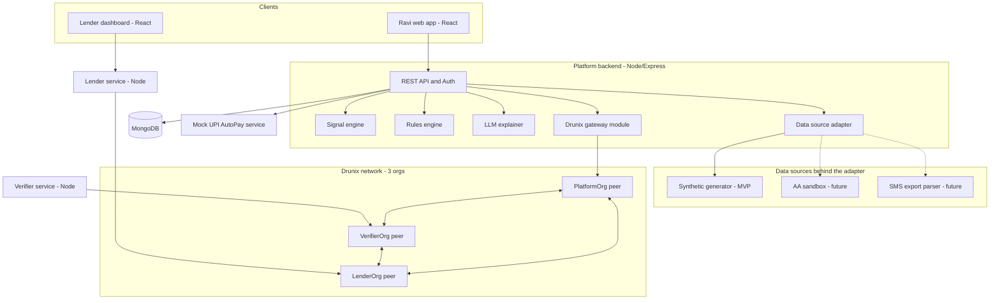
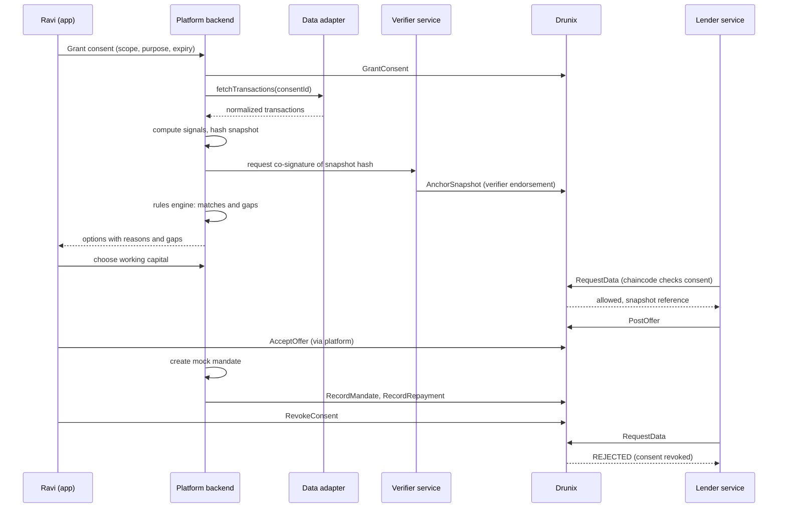

# FlowProof

### A verifiable eligibility and offer layer for payment-active, credit-invisible micro-merchants

**Drunix Hackathon (NPCI x Citi) · Problem Statement 4: Financial Inclusion**

> **One line:** A micro-merchant's UPI activity already proves he is reliable, but no lender can use it. FlowProof turns his *consented* payment history into explainable signals, matches him to financial products with reasons and gaps, and takes him from consent to accepted offer to repayment on a Drunix ledger that the user, the data verifier and the lender all share.

---

## Table of contents

1. [Problem statement and PS4 fit](#1-problem-statement-and-ps4-fit)
2. [Who we serve](#2-who-we-serve)
3. [Solution overview](#3-solution-overview)
4. [Honest positioning: what exists and what is different](#4-honest-positioning-what-exists-and-what-is-different)
5. [Actors and organisations](#5-actors-and-organisations)
6. [Features and MVP scope](#6-features-and-mvp-scope)
7. [User flow](#7-user-flow)
8. [System architecture](#8-system-architecture)
9. [Drunix layer](#9-drunix-layer)
10. [Data source layer and mock APIs](#10-data-source-layer-and-mock-apis)
11. [Signals, rules engine and AI](#11-signals-rules-engine-and-ai)
12. [Tech stack (MERN)](#12-tech-stack-mern)
13. [Data model (MongoDB)](#13-data-model-mongodb)
14. [API design](#14-api-design)
15. [Integrations: real vs mocked](#15-integrations-real-vs-mocked)
16. [Security, privacy and compliance](#16-security-privacy-and-compliance)
17. [Demo script](#17-demo-script)
18. [Build plan](#18-build-plan)
19. [Risks and mitigations](#19-risks-and-mitigations)
20. [What we do not claim](#20-what-we-do-not-claim)
21. [Roadmap](#21-roadmap)
22. [Open items to verify](#22-open-items-to-verify)

---

## 1. Problem statement and PS4 fit

**PS4: Financial Inclusion.** The hackathon brief is to build fintech solutions on the Drunix platform that reshape India's digital payments landscape, with access to NPCI APIs and infrastructure. The PS4 text provided is only the title, so we interpret it as:

> *Bring an underserved group into formal finance using payments infrastructure, built on Drunix.*

### The real problem

Millions of small merchants transact digitally all day, yet:

- They **do not know** which credit, insurance or savings products they qualify for.
- When they do not qualify, they get **silent rejection**: no reason, no path to fix it.
- Every application means **re-proving the same facts** to a new institution.

The issue is not "no financial activity". It is that their **activity is not usable as proof**.

### How we answer PS4

| The brief asks for        | Our answer                                                                                 |
| ------------------------- | ------------------------------------------------------------------------------------------ |
| Financial inclusion       | Payment-active but credit-invisible merchants get access, discovery and an explained path  |
| Payments and NPCI context | Signals derived from UPI-style transaction data; repayment via a UPI AutoPay-style mandate |
| Built on Drunix           | Multi-party ledger for consent, verified snapshot, offer, agreement and repayment          |
| Working prototype         | One end-to-end flow, running locally, with mocked external data                            |

---

## 2. Who we serve

**Primary persona: Ravi, a kirana shopkeeper.**

- 40 to 60 UPI credits a day, weekly supplier payments, one small loan repaid earlier.
- No strong bureau history and no idea what he qualifies for.
- Wants working capital, cheap insurance and a way to save, but does not know where to start.

**Secondary persona: Meena (near-miss case).** Irregular inflows, no repayment history. She exists in the demo so the system visibly gives a *different* answer and shows *what is missing*.

**Institution persona: a lender.** Wants verified, consented, reproducible inputs, not screenshots or PDFs.

---

## 3. Solution overview

FlowProof has five capabilities:

1. **Consented data intake.** The user grants consent (scope, purpose, expiry). Transaction data comes through a swappable data-source adapter.
2. **Explainable signals.** Deterministic code computes a few plain signals from the transactions.
3. **Matching with gaps.** A rules engine checks signals against product criteria and returns *matched (with reasons)* or *not yet (with what is missing and how to fix it)*.
4. **Verifiable lifecycle on Drunix.** Consent, a hash of the signal snapshot plus rule-set version, verifier co-signature, data requests, offer, acceptance and repayment events are recorded on a permissioned multi-org ledger.
5. **Closed loop.** Repayment via a mandate (mocked rails), recorded on the same chain.

### Why "reproducible eligibility" is the core idea

When a match is made, we anchor `hash(signal snapshot) + rule-set version` on Drunix, co-signed by the verifier. Later, any party can check *what the match was based on* and *which rules produced it*. Existing consent-sharing systems move data; they do not give the user and the lender a shared, verifiable record of the whole decision chain.

---

## 4. Honest positioning: what exists and what is different

### What already exists (do not claim novelty here)

- **Account Aggregator (AA) framework and OCEN** already enable consent-based, cash-flow-based MSME lending in India.
- **Nova Credit's Credit Passport** already offers a consumer-permissioned portable credit profile (cross-border focus).
- "Blockchain for portable identity and consent" is a common pitch.
- At least one other hackathon team is building a payments-plus-consent-plus-blockchain inclusion project, so overlap is likely.

### What we add (defensible differences)

1. **Reproducible eligibility.** Snapshot hash and rule version anchored and co-signed, so decisions can be audited.
2. **Gap analysis.** Users learn what is missing, not just "rejected".
3. **Closed, auditable loop.** Discovery, consent, offer, acceptance and repayment in one chain, where AA covers mainly the data-sharing step.
4. **User-side discovery.** Starts from the user's position ("what can I get?"), not from a lender's embedded offer.

### Positioning sentence

> AA and OCEN solve data access and lender-side credit. FlowProof sits on top of them and adds a user-side discovery layer with a verifiable lifecycle for consent, matching, offers and agreements.

---

## 5. Actors and organisations

| Actor                                | Role                                                      | Drunix identity                                                            |
| ------------------------------------ | --------------------------------------------------------- | -------------------------------------------------------------------------- |
| **Ravi (user)**                | Grants and revokes consent, chooses offers, accepts       | Identity enrolled under the Platform org (users are identities, not nodes) |
| **Platform org**               | Runs the user app, computes signals, submits user actions | `PlatformOrg`                                                            |
| **Verifier / data-source org** | Simulates the bank/AA side; co-signs the snapshot hash    | `VerifierOrg`                                                            |
| **Lender org**                 | Requests data, posts offers, records repayments           | `LenderOrg`                                                              |

Each org runs as its **own backend process with its own credentials**. This is what makes the multi-party argument real in the demo (see section 9.2).

---

## 5A. One-page pitch

**Problem.** Micro-merchants transact digitally every day but cannot turn that into access to credit, insurance or savings. They do not know what they qualify for, get rejected without reasons, and must re-prove the same facts to every institution.

**Solution.** FlowProof converts consented payment history into explainable signals, matches users to products with reasons and gaps, and records the whole lifecycle on Drunix.

**Drunix.** Provides the shared, permissioned, tamper-evident state that the user side, the verifier and the lender all trust: consent, snapshot proof, offers, agreements and repayment.

**AI.** Extracts signals, explains results in plain language, and can flag abnormal patterns. It never decides eligibility.

**Impact.** People with real payment activity but no credit history can see what they qualify for, why, and what to fix.

---

## 6. Features and MVP scope

### Must build (MVP)

| #  | Feature                                            | Notes                                      |
| -- | -------------------------------------------------- | ------------------------------------------ |
| 1  | Consent creation with scope, purpose, expiry       | Written to Drunix                          |
| 2  | Consent revocation that blocks later data requests | Chaincode-enforced check plus backend gate |
| 3  | Data-source adapter with synthetic backend         | AA-shaped interface                        |
| 4  | Signal engine (4 signals)                          | Deterministic, each with a plain reason    |
| 5  | Snapshot anchoring with verifier co-signature      | Hash and rule version on Drunix            |
| 6  | Rules engine over 3 illustrative products          | Returns matches, reasons and gaps          |
| 7  | LLM explanations (English, optional Hindi)         | Text only, fed structured output           |
| 8  | Lender request, offer, user acceptance             | On Drunix, offer terms in private data     |
| 9  | Mock repayment mandate and one repayment cycle     | Events on Drunix                           |
| 10 | Ledger timeline view                               | Human-readable event history               |
| 11 | Two dashboards (Ravi and lender)                   | One React app with role views is fine      |

### Should build if time allows

- Second persona (Meena) with near-miss display
- Hindi explanations
- SMS-export upload and parser as second data backend
- Signal-change simulation ("if you do X, you would qualify")

### Explicitly out of scope for the MVP (roadmap)

- Live AA or UPI integration, real KYC
- Marketplace with many institutions
- Anomaly detection, government-benefit matching
- Real ML credit models

---

## 7. User flow

**Ravi's journey**

1. Log in and choose "Connect payment history".
2. **Consent screen:** what data, shared with whom, for what purpose, until when.
3. **Signals screen:** four signals, each with a one-line explanation.
4. **Options screen:** two matched products with "why you matched", plus one near-miss with "what is missing and how to fix it".
5. He picks working capital and sees exactly which data the lender will receive.
6. An **offer** arrives (amount, tenure, cost). He accepts.
7. He sets up a **repayment mandate**; one repayment cycle runs.
8. **Consent page:** he revokes. The lender's next data request is refused.

**Lender's journey**

1. Sees incoming interest from a consented user (snapshot ID, signals, verifier co-signature status).
2. Requests data. The request succeeds only if consent is active, in scope and unexpired.
3. Posts an offer referencing the snapshot hash.
4. Sees acceptance, mandate and repayment events.

---

## 8. System architecture

### 8.1 Layered view (ASCII, renders anywhere)

```text
┌────────────────────────────────────────────────────────────────────┐
│ CLIENT LAYER                                                       │
│   Ravi web app (React)                Lender dashboard (React)     │
└───────────────┬──────────────────────────────────┬─────────────────┘
                │ REST                             │ REST
┌───────────────▼────────────────────┐   ┌─────────▼─────────────────┐
│ PLATFORM BACKEND (Node/Express)    │   │ LENDER SERVICE (Node)     │
│  Auth · Consent · Signal engine    │   │  Requests · Offers        │
│  Rules engine · LLM explainer      │   │  Own Drunix identity      │
│  Data source adapter · Drunix mod. │   └─────────┬─────────────────┘
└───┬───────────┬──────────┬─────────┘             │
    │           │          │       ┌───────────────┴─────────────┐
    │           │          │       │ VERIFIER SERVICE (Node)     │
    │           │          │       │  Co-signs snapshot hashes   │
    │           │          │       └───────────────┬─────────────┘
┌───▼─────┐ ┌───▼──────┐ ┌─▼────────────┐          │
│ MongoDB │ │ Data     │ │ Mock UPI     │          │
│ app data│ │ sources  │ │ AutoPay svc  │          │
└─────────┘ │ synthetic│ └──────────────┘          │
            │ AA (fut.)│                           │
            │ SMS (fut)│                           │
            └──────────┘                           │
┌──────────────────────────────────────────────────▼─────────────────┐
│ DRUNIX NETWORK (local, 3 orgs, Go chaincode)                       │
│   PlatformOrg          VerifierOrg           LenderOrg             │
│   consent · snapshot anchors · data requests · offers · agreements │
│   repayment events · audit trail                                   │
└────────────────────────────────────────────────────────────────────┘
```

### 8.2 Component diagram (Mermaid)



### 8.3 End-to-end sequence (Mermaid)



### 8.4 Layer responsibilities

| Layer            | Responsibility                                         | Trust model             |
| ---------------- | ------------------------------------------------------ | ----------------------- |
| Client           | UI only                                                | Untrusted               |
| Platform backend | Business logic, signals, matching, gating data release | Trusted by user side    |
| Verifier service | Independently vouches for the snapshot hash            | Separate identity       |
| Lender service   | Institution-side actions                               | Separate identity       |
| Data adapter     | One interface over many sources                        | Swappable               |
| MongoDB          | Application data (raw transactions, users, signals)    | Off-chain               |
| Drunix           | Shared multi-party state and audit trail               | Permissioned, multi-org |

---

## 9. Drunix layer

> **Verification note.** The Drunix facts below come from public repositories of other hackathon teams and the Drunix README as quoted there. Confirm them against `github.com/npci/drunix` before locking the design.

### 9.1 What Drunix is

- NPCI's open-source, enhanced fork of **Hyperledger Fabric**: permissioned, multi-organisation.
- Business logic is **chaincode** (Go, Java, JS or TS), not Solidity contracts. Go has the most samples.
- Fabric-style features we plan to use: organisations with MSP identities, channels, private data collections, endorsement policies, Raft ordering.
- Drunix has its own architecture variations (lite peer, committing peer, validation service, SQL state database). We do not depend on these for the MVP.
- Runs locally via Docker; expect setup quirks (for example, pulling the chaincode builder image manually).

### 9.2 Why Drunix and not just MongoDB

- **MongoDB = application data.** One party controls it.
- **Drunix = shared multi-party state.** User side, verifier and lender should not have to trust any single party's database for *who consented to what, what was verified, what was offered and what was accepted*.
- The rules are enforced by **chaincode on every org**, not by one app's promise.

The argument only holds if the demo runs **separate orgs with separate identities**. We run three.

### 9.3 What goes on Drunix and what does not

| On Drunix                                     | Off-chain (MongoDB)            |
| --------------------------------------------- | ------------------------------ |
| Consent (scope, purpose, expiry, status)      | Raw transactions               |
| Snapshot hash and rule-set version            | Full signal values and history |
| Verifier signature/endorsement                | User profile                   |
| Data requests (who, when, allowed or refused) | Product catalogue              |
| Offer references, acceptance, agreement hash  | LLM explanations               |
| Mandate and repayment events                  | UI state                       |

**Offer terms** (amount, rate) live in a **private data collection** shared only between the Platform and Lender orgs. The public ledger holds only their hash.

### 9.4 Chaincode data model (design)

```text
ConsentRecord   { consentId, userId, purpose, scope[], grantedTo[],
                  issuedAt, expiresAt, status: ACTIVE|REVOKED|EXPIRED,
                  aaConsentRef? }
SnapshotAnchor  { snapshotId, consentId, snapshotHash, ruleSetVersion,
                  verifierOrg, verifierSig, createdAt }
DataRequest     { requestId, consentId, lenderOrg, fields[],
                  outcome: ALLOWED|REFUSED, reason, ts }
Offer           { offerId, snapshotId, lenderOrg, termsHash,
                  status: OPEN|ACCEPTED|EXPIRED, createdAt }
Agreement       { agreementId, offerId, acceptedBy, acceptedAt, termsHash }
RepaymentEvent  { agreementId, seq, amount, status, ts }
```

### 9.5 Chaincode functions (design)

| Function                                | Who calls                      | Rule enforced                                                                                          |
| --------------------------------------- | ------------------------------ | ------------------------------------------------------------------------------------------------------ |
| `GrantConsent`                        | Platform                       | Valid scope, purpose, future expiry                                                                    |
| `RevokeConsent`                       | Platform (user-initiated)      | Consent exists and is ACTIVE                                                                           |
| `AnchorSnapshot`                      | Platform, endorsed by Verifier | Consent ACTIVE; needs verifier endorsement (endorsement policy)                                        |
| `RequestData`                         | Lender                         | Lender in`grantedTo`, fields within `scope`, consent ACTIVE and unexpired; logs ALLOWED or REFUSED |
| `PostOffer`                           | Lender                         | Snapshot exists; a prior ALLOWED request exists                                                        |
| `AcceptOffer`                         | Platform (user-signed)         | Offer OPEN; creates Agreement                                                                          |
| `RecordMandate` / `RecordRepayment` | Platform / Lender              | Agreement exists; sequence increments                                                                  |
| `GetHistory(consentId)`               | Any authorised org             | Returns timeline for the ledger view                                                                   |

### 9.5A Endorsement and privacy design

- **Endorsement policy:** `AnchorSnapshot` requires both PlatformOrg and VerifierOrg, so a snapshot cannot be anchored by the platform alone.
- **Private data:** offer terms and data-request field lists sit in a collection restricted to the parties involved.
- **Channel:** one channel is enough for the MVP. Channel-per-arrangement is a roadmap idea.

### 9.6 What the ledger does and does not guarantee (be honest)

- It guarantees an **authoritative, tamper-evident record** and **rule enforcement for on-chain actions**.
- It does **not** physically stop a lender from keeping data it already fetched. Off-chain data release is gated by the backend, which checks chain state first. The ledger makes every access **auditable and attributable**.
- Consent revocation on Drunix stops later authorised requests; deleting or withholding off-chain data is done by our backend.

---

## 10. Data source layer and mock APIs

### 10.1 Reality check

- There is **no public UPI transaction-history API** for third parties. UPI transactions sit in the user's bank account.
- India's regulated route is the **Account Aggregator framework**: consent request, user approval at the AA, consent artefact to the FIU and the bank (FIP), encrypted data fetch, revocation at any time.
- Production access requires FIU onboarding and certification, which is out of scope for a hackathon. Sandboxes exist (Setu, Finvu, OneMoney and others) but serve mock data.

### 10.2 Design: one interface, three backends

Backend code only ever calls this interface:

```text
DataSource {
  createConsent(userId, scope, purpose, expiry)  -> consentRef
  getConsentStatus(consentRef)                   -> status
  fetchTransactions(consentRef)                  -> Transaction[]
  revokeConsent(consentRef)                      -> void
}
```

| Backend                                                | Status            | Purpose                                                    |
| ------------------------------------------------------ | ----------------- | ---------------------------------------------------------- |
| **Synthetic generator**                          | **MVP**     | Controlled story for the demo                              |
| **AA sandbox adapter** (Setu / Finvu / OneMoney) | Future            | Proves the real consent flow; mock FIP data                |
| **SMS export parser**                            | Future / optional | Real transactions from a real phone; Android-only fallback |

The AA-shaped interface means switching from mock to real is a config change plus one adapter, not a rewrite.

### 10.3 Normalized transaction schema (every backend must produce this)

```json
{
  "txnId": "T-000123",
  "timestamp": "2026-03-14T10:42:00+05:30",
  "amount": 250.0,
  "direction": "CREDIT",
  "mode": "UPI",
  "counterparty": "customer@upi",
  "narration": "UPI/CR/...",
  "balanceAfter": 8420.5
}
```

### 10.4 Synthetic data generator spec

**Ravi (strong profile), about 6 months**

- Credits: 40 to 60 small UPI credits a day (₹50 to ₹800), weekend uplift, one festival spike.
- Debits: supplier payments once or twice a week, monthly rent, monthly small-loan EMI paid on time.
- Balance: positive, low-moderate buffer.

**Meena (near-miss profile)**

- Irregular credits with gaps, no recurring repayment, thin buffer.

**Config file** controls: number of days, credits per day range, supplier cadence, EMI amount/day, noise level, festival dates. Seeded randomness so demos are reproducible.

### 10.5 SMS parsing spec (future backend)

- Android only. Simplest path: export SMS to XML with a backup app, upload the file, parse on the backend.
- Filter by **bank sender IDs**; ignore OTP and personal messages; extract only structured fields.
- Regex templates per bank, with an LLM fallback for unseen formats.
- Deduplicate (the same transaction can produce multiple messages).
- **Limitation:** coverage varies by bank (small UPI credits are not always SMSed; balance is not always included).
- **Compliance:** treat as a demo/offline fallback. RBI's 2025 Digital Lending Directions require explicit consent for data collection and limit access to mobile phone resources, so SMS is not the production path; AA is.

### 10.6 Mock services

| Mock                                    | What it imitates                      | Notes                                                                 |
| --------------------------------------- | ------------------------------------- | --------------------------------------------------------------------- |
| `mock-aa` (part of synthetic backend) | AA consent and data-session behaviour | Same four operations as the interface                                 |
| `mock-upi-autopay`                    | Mandate creation and periodic debit   | Returns SUCCESS or FAILED events; swappable for the real NPCI sandbox |
| Verifier service                        | Bank/AA-side attestation              | Signs snapshot hash under its own org identity                        |

### 10.7 Data handling rules

- Raw transactions are stored in MongoDB tagged with the consent ID.
- On revocation or expiry, the backend **stops serving and deletes** them.
- Nothing raw goes on Drunix; only hashes and status records.

---

## 11. Signals, rules engine and AI

### 11.1 Signals (deterministic, explainable)

| Signal                        | Definition (illustrative)                                                 | Output                         |
| ----------------------------- | ------------------------------------------------------------------------- | ------------------------------ |
| **Income regularity**   | Variation of weekly inflow over 24 weeks (lower variation = more regular) | High / Medium / Low + reason   |
| **Activity trend**      | Slope of the 4-week moving average of credit count/amount                 | Growing / Stable / Declining   |
| **Repayment behaviour** | Share of recurring EMI-like debits paid on time                           | Good / Mixed / None            |
| **Savings buffer**      | Average balance divided by average weekly outflow (weeks of cover)        | Weeks of cover, Low / Adequate |

Thresholds live in config, versioned, and their hash forms the `ruleSetVersion`.

**Caveat to state openly:** business and personal money often mix in one account, so these are *indicators*, not verified business income.

### 11.2 Rules engine

Deterministic eligibility check: `eligible(signals, product.criteria) -> { matched, reasons[], gaps[] }`.

**Illustrative product catalogue (placeholder thresholds; replace with verified real criteria before naming real schemes)**

| Product                | Illustrative criteria                                                     | Gap example                                          |
| ---------------------- | ------------------------------------------------------------------------- | ---------------------------------------------------- |
| Working-capital line   | Income regularity ≥ Medium, activity not declining, repayment not "None" | "No repayment history: repay one small loan on time" |
| Micro-insurance        | Active account with regular inflow over 3+ months                         | "Less than 3 months of activity"                     |
| Recurring savings plan | Buffer under 2 weeks and stable inflow                                    | "Buffer already adequate: not needed"                |

**Example output**

```json
{
  "product": "Working capital line",
  "matched": false,
  "reasons": ["Income regularity: High", "Activity: Growing"],
  "gaps": [
    {
      "criterion": "Repayment behaviour",
      "current": "None",
      "needed": "At least Mixed",
      "howToFix": "Complete one small loan repayment on time"
    }
  ]
}
```

### 11.3 Where AI is used (and where it is not)

| Use                                                                           | Yes/No                                                                   |
| ----------------------------------------------------------------------------- | ------------------------------------------------------------------------ |
| Turn structured match output into plain-language explanations (English/Hindi) | **Yes**                                                            |
| Optionally parse messy SMS formats                                            | Future                                                                   |
| Optionally flag abnormal transaction patterns                                 | Roadmap                                                                  |
| Decide eligibility                                                            | **No: rules engine decides; the institution makes the final call** |

**LLM guardrails:** the explainer receives only the structured result; it must not add facts or numbers not in that input; if the call fails, a template-based explanation is shown.

---

## 12. Tech stack (MERN)

| Layer             | Technology                                                     | Notes                                                                |
| ----------------- | -------------------------------------------------------------- | -------------------------------------------------------------------- |
| **M**ongoDB | MongoDB + Mongoose                                             | Application data (raw txns, users, signals, offers, mirrored events) |
| **E**xpress | Node.js + Express                                              | Three small services: platform, verifier, lender                     |
| **R**eact   | React + Vite + Tailwind                                        | One app with Ravi and Lender views, or two routes                    |
| **N**ode    | Node 20+, TypeScript recommended                               | Same language across backend and Fabric gateway client               |
| Ledger            | Drunix (local, Docker, 3 orgs)                                 | Real, not mocked                                                     |
| Chaincode         | Go                                                             | Most Drunix samples are Go                                           |
| Ledger client     | Fabric Gateway SDK for Node (verify compatibility with Drunix) | One module in the platform backend                                   |
| LLM               | Anthropic API                                                  | Explanations only                                                    |
| Auth              | JWT for the app; Fabric identities for ledger actions          | Keep simple for MVP                                                  |
| Infra             | Docker Compose                                                 | Drunix network plus MongoDB plus services                            |

### 12.1 Suggested repository layout

```text
flowproof/
├── chaincode/                 # Go chaincode (consent, snapshot, offers...)
├── network/                   # Drunix local network scripts, org configs
├── services/
│   ├── platform/              # Express API: auth, consent, signals, rules, LLM
│   │   ├── src/adapters/      # DataSource interface + synthetic backend
│   │   ├── src/signals/
│   │   ├── src/rules/         # rules.config.json (versioned)
│   │   ├── src/ledger/        # Drunix gateway module
│   │   └── src/routes/
│   ├── verifier/              # Express: co-signs snapshot hashes
│   ├── lender/                # Express: requests, offers
│   └── mock-upi-autopay/      # Mandate mock
├── web/                       # React app (Ravi + lender views + ledger timeline)
├── data/
│   └── generator/             # Synthetic transaction generator + config
├── docs/
└── docker-compose.yml
```

---

## 13. Data model (MongoDB)

| Collection       | Key fields                                                                                  |
| ---------------- | ------------------------------------------------------------------------------------------- |
| `users`        | userId, name, role (USER/LENDER), personaId                                                 |
| `consents`     | consentId, userId, scope, purpose, expiresAt, status, chainTxId                             |
| `transactions` | consentId, txnId, timestamp, amount, direction, mode, counterparty, narration, balanceAfter |
| `snapshots`    | snapshotId, consentId, signals{}, snapshotHash, ruleSetVersion, verifierSig, chainTxId      |
| `matches`      | snapshotId, product, matched, reasons[], gaps[], explanationText                            |
| `offers`       | offerId, snapshotId, lenderId, terms (mirrored), status, chainTxId                          |
| `agreements`   | agreementId, offerId, acceptedAt, chainTxId                                                 |
| `mandates`     | agreementId, mandateRef, schedule, status                                                   |
| `repayments`   | agreementId, seq, amount, status, chainTxId                                                 |
| `auditMirror`  | copy of ledger events for fast UI reads (source of truth remains Drunix)                    |

---

## 14. API design

### Platform service

| Method | Endpoint                        | Purpose                                                      |
| ------ | ------------------------------- | ------------------------------------------------------------ |
| POST   | `/auth/login`                 | Demo login (Ravi / Meena)                                    |
| POST   | `/consents`                   | Create consent (adapter plus`GrantConsent`)                |
| GET    | `/consents/:id`               | Status                                                       |
| POST   | `/consents/:id/revoke`        | Revoke (ledger plus delete off-chain data)                   |
| POST   | `/consents/:id/fetch`         | Pull transactions through the adapter                        |
| POST   | `/snapshots`                  | Compute signals, hash, request verifier co-signature, anchor |
| GET    | `/snapshots/:id/matches`      | Matches, reasons, gaps, explanations                         |
| POST   | `/offers/:id/accept`          | Accept offer (ledger)                                        |
| POST   | `/agreements/:id/mandate`     | Create mock mandate                                          |
| GET    | `/ledger/timeline/:consentId` | Ledger event history for the UI                              |

### Verifier service

| POST | `/cosign` | Validate hash against the data it fetched, then endorse `AnchorSnapshot` |

### Lender service

| Method | Endpoint           | Purpose                                                         |
| ------ | ------------------ | --------------------------------------------------------------- |
| POST   | `/data-requests` | Calls`RequestData`; returns allowed data reference or refusal |
| POST   | `/offers`        | `PostOffer`                                                   |
| GET    | `/agreements`    | Agreements and repayment status                                 |

### Mock UPI AutoPay

| POST | `/mandates` | Create mandate |
| POST | `/mandates/:id/debit` | Trigger one debit; returns SUCCESS/FAILED |

---

## 15. Integrations: real vs mocked

| Piece               | MVP plan                                   | Path to real                                                           |
| ------------------- | ------------------------------------------ | ---------------------------------------------------------------------- |
| Drunix network      | **Real**, local Docker, 3 orgs       | Same code on a shared/hosted network                                   |
| Chaincode           | **Real** Go chaincode                | Same                                                                   |
| Transaction data    | **Mock**: synthetic generator        | AA sandbox adapter, then production AA as an FIU (needs certification) |
| SMS ingestion       | Not in MVP (documented)                    | Export-parse backend, Android fallback                                 |
| NPCI APIs           | Unknown access;**mock** where needed | Swap`mock-upi-autopay` for the real NPCI sandbox                     |
| UPI AutoPay mandate | **Mock**                             | NPCI mandate APIs                                                      |
| Product criteria    | **Illustrative** config              | Verified real scheme/product rules                                     |
| LLM                 | **Real** Anthropic API               | Same                                                                   |
| KYC/identity        | **Skipped**                          | Aadhaar/DigiLocker-style flows                                         |

---

## 16. Security, privacy and compliance

- **Data minimisation:** raw transactions never touch the ledger; only hashes, consent artefacts and events.
- **Consent as a first-class object:** scope, purpose, expiry and revocation on every data access.
- **Separation of duties:** verifier and lender run under separate identities; anchoring a snapshot requires the verifier's endorsement.
- **Revocation:** blocks later requests on chain; backend stops serving and deletes off-chain data.
- **DPDP alignment (design intent):** purpose limitation, consent withdrawal, minimal retention. Hashes on-chain avoid the erasure problem for personal data.
- **SMS caveat:** not a production path for lending apps under RBI's digital lending rules; AA is.
- **LLM safety:** explanations only, structured input, no decisions, template fallback.
- **Synthetic data disclosure:** state clearly in the demo that data is synthetic and modelled on AA/UPI formats.

---

## 17. Demo script (5 minutes)

1. **Set the scene (30s).** Ravi: payment-active, credit-invisible. Show his synthetic history summary.
2. **Consent (30s).** He grants consent; show the record appear on the ledger timeline.
3. **Signals (45s).** Four signals with plain explanations; snapshot hash anchored, verifier co-signature visible.
4. **Options (60s).** Two matches with reasons; one near-miss (Meena, or a third product) with "what is missing and how to fix it".
5. **Lender side (45s).** Lender dashboard requests data; chaincode allows it; lender posts an offer (terms in private data, hash public).
6. **Accept and repay (45s).** Ravi accepts; mandate created; one repayment cycle recorded.
7. **Revocation (45s).** Ravi revokes; lender's next request is **refused by chaincode**; show the refusal on the timeline.
8. **Close (30s).** Reproducible eligibility, gap analysis, closed auditable loop; roadmap to AA and NPCI sandbox.

---

## 18. Build plan

Order by risk, not by visibility.

| Phase                           | Work                                                                                             | Done when                                        |
| ------------------------------- | ------------------------------------------------------------------------------------------------ | ------------------------------------------------ |
| **0. Ledger first**       | Clone`npci/drunix`; run a local 3-org network; deploy a trivial chaincode; invoke it from Node | Three orgs, three identities, one working invoke |
| **1. Consent on chain**   | `GrantConsent`, `RevokeConsent`, `RequestData` with rule checks                            | Revoked consent makes`RequestData` refuse      |
| **2. Data and signals**   | Synthetic generator, adapter interface, four signals, snapshot hash                              | Ravi and Meena produce different signals         |
| **3. Anchoring**          | Verifier service, endorsement policy,`AnchorSnapshot`                                          | Snapshot cannot be anchored without verifier     |
| **4. Matching**           | Rules config, matches, gaps, LLM explainer                                                       | Ravi gets matches; Meena gets gaps               |
| **5. Offer to repayment** | `PostOffer`, `AcceptOffer`, mock mandate, repayment events                                   | Full lifecycle on ledger                         |
| **6. UI**                 | Ravi view, lender view, ledger timeline                                                          | Demo script runs end to end                      |
| **7. Polish**             | Hindi text, copy, pitch deck, README, architecture image                                         | Ready to present                                 |

Suggested split for a small team: (a) chaincode and network, (b) backend services and adapter, (c) signals/rules/LLM, (d) frontend and demo.

---

## 19. Risks and mitigations

| Risk                                                          | Mitigation                                                                                 |
| ------------------------------------------------------------- | ------------------------------------------------------------------------------------------ |
| Drunix setup is slow or quirky                                | Do Phase 0 first; keep chaincode simple; verify Gateway SDK compatibility early            |
| Drunix lacks a feature we assumed (private data, endorsement) | Fall back to hashes plus separate channel/collection; document the gap honestly            |
| Scope creep (original idea had eight layers)                  | Freeze on the MVP table in section 6; everything else is roadmap                           |
| Judges say "this is just AA/OCEN"                             | Use the positioning sentence in section 4; lead with reproducible eligibility and gaps     |
| Overlap with similar projects                                 | Emphasise the differentiators; demo the gap analysis and refusal on revocation             |
| Synthetic data looks contrived                                | Keep signals simple; disclose synthetic data; show adapter design for real sources         |
| Thresholds seen as arbitrary                                  | Label as illustrative; keep them in versioned config                                       |
| LLM output errors                                             | Structured input, no decisions, template fallback                                          |
| Team runs out of time                                         | Cut order: Hindi, Meena, SMS backend, timeline polish; never cut Drunix flow or revocation |

---

## 20. What we do not claim

- We do **not** claim to automatically approve loans or replace institutions' decisions.
- We do **not** claim AI determines who deserves credit.
- We do **not** claim blockchain makes loans safer.
- We do **not** claim access to real bank/UPI data or live NPCI integration; data is synthetic and modelled on AA/UPI formats.
- We do **not** claim to replace AA or OCEN; we build on their ideas.
- We do **not** claim to be the first consented portable financial profile.

**What we do claim:** a working prototype showing consented data, explainable signals, gap-aware matching, and a verifiable multi-party lifecycle on Drunix, with a clear path to real data sources.

---

## 21. Roadmap

1. **AA sandbox integration** (Setu, Finvu or OneMoney) as the second data backend; then production via a certified FIU partner.
2. **NPCI sandbox** for real mandate and payment flows.
3. **More institutions and products** (insurers, benefit schemes) on the same ledger, with channel-per-arrangement.
4. **Anomaly detection** and richer signals, still explainable.
5. **Government benefit matching** from structured scheme rules (LLM-assisted, human-reviewed).
6. **Regulatory hardening:** DPDP consent artefacts, audit exports for regulators.

---

## 22. Open items to verify

- [ ] Actual Drunix capabilities: private data collections, endorsement policies, multi-org local network, Gateway SDK compatibility.
- [ ] Which NPCI APIs/sandboxes are actually accessible to us (if any).
- [ ] Real product/scheme criteria before naming any real scheme; current thresholds are illustrative.
- [ ] AA sandbox signup time and mock-data suitability.
- [ ] Any additional PS4 text or judging criteria beyond the title and blurb.
- [ ] Team size, skills and hours remaining, to finalise the build split.
